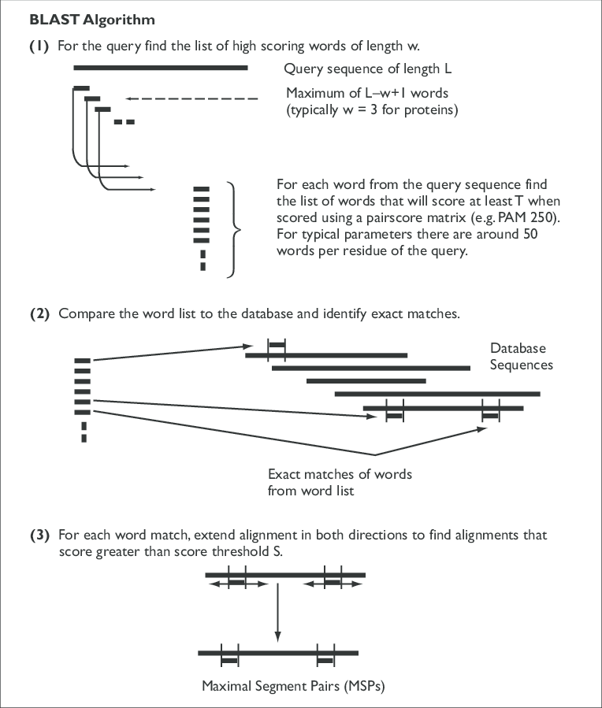

  

---

## Table of Contents
- [Introduction](#introduction)
- [Algorithm in Brief](#algorithm-in-brief)
- [Usage](#usage)
- [References](#references)

---

## Introduction

This repository holds an heuristic algortihm whose goal is to find the best letter sequence match in a massive sequential letter database. This heuristic algorithm is called BLAST [1], and is used to retrieve best DNA or protein sequence matches. The problem arrises when, for example a 100 character long string has to be searched in a database that holds around 300 billion characters.

---

## Algorithm in Brief

Here I want to present the main steps in this algorithm which are later depicted in the picture below:
- First of all the query sequence is divided into so called k-mers which are usually of length 3 (k = 3);
- Then the database sequences are taken and indexed for more efficient processing of data;
- Each sequence fragments (query and database) are compared and only high scoring sequence pairs move to the next step. This step is compared to some predefined value (for example 14);
- Then each k-mer is elongated from both sides along the database string. This elongation occurs as long as the global score of the pair doesn't drop below some predefined threshold T;

It is important to note, that sequence pair score is calculated based on certain matrices, such as BLOSUM62 that is used in this project. These matrices were created using various statistical methods from multiple sequence alignments that is a large topic.

Algorithm steps are shown below [2].

---

## Usage

This algorithm can be run from inside the **main.py** script.

---

## References
1. McGinnis, S., & Madden, T. L. (2004). BLAST: at the core of a powerful and diverse set of sequence analysis tools. Nucleic acids research, 32(Web Server issue), W20–W25. https://doi.org/10.1093/nar/gkh435
2. Sansom, Clare. (2000). Database searching with DNA and protein sequences: An introduction. Briefings in bioinformatics. 1. 22-32. 10.1093/bib/1.1.22. 